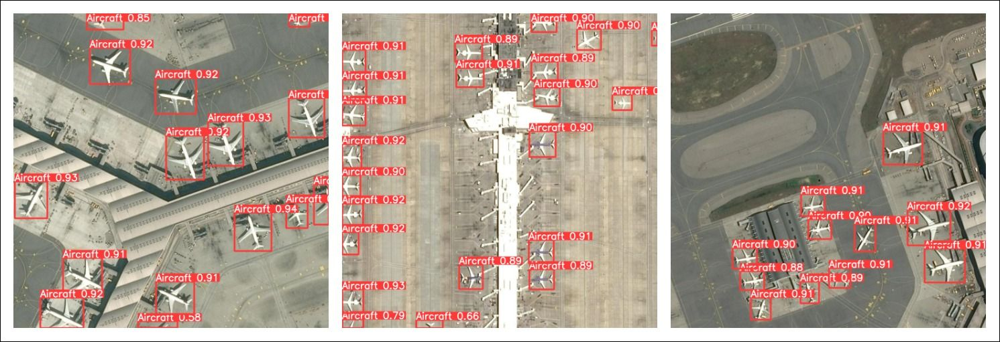
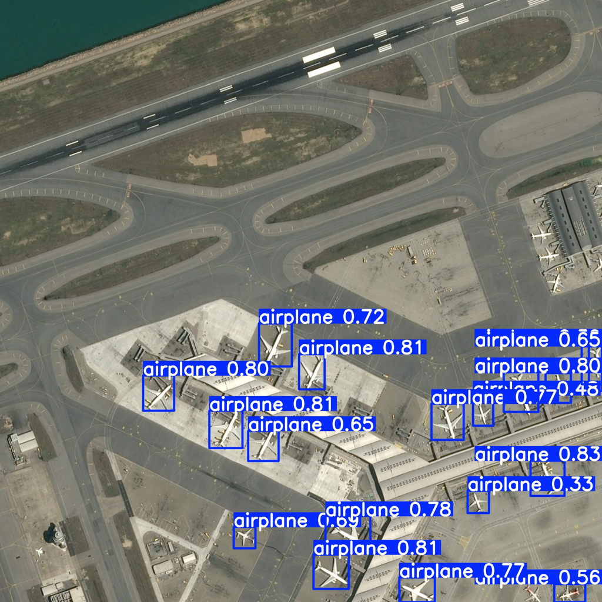
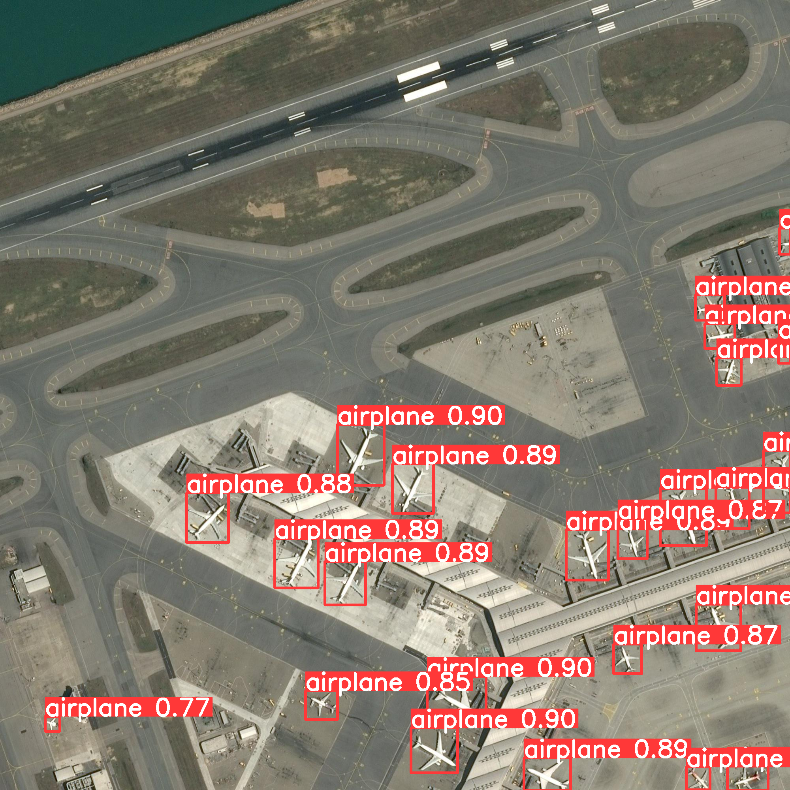

# 🛩️ Airplane Detection from Satellite Imagery

### YOLOv11n Training with SAHI-based Inference

This repository demonstrates an end-to-end workflow for detecting airplanes in satellite imagery using a lightweight YOLOv11n object detection model.
To improve detection performance on small and sparsely distributed objects, it applies SAHI (Slicing Aided Hyper Inference) during inference.

[](
https://colab.research.google.com/github/sagar100rathod/airplane-object-detection-from-aerial-imagery/blob/main/End-to-End-YOLOv11-finetuning.ipynb
)

## Overview

Detecting airplanes in satellite or aerial imagery is challenging due to:

 * Very small object sizes relative to image resolution.

 * Large image dimensions.

 * Background clutter and class imbalance.




This repository addresses these challenges by:

* Training a YOLOv11n (nano) model on satellite imagery.

* Applying SAHI slicing during inference to boost recall for small objects.

* Providing a single end-to-end Jupyter notebook covering training, validation, and inference.
  

## ✨ Key Features

* End to End YOLOv11n training on patched satellite imagery.

* Optimized for small object detection (airplanes).

* SAHI-based sliced inference for improved detection.

* Lightweight model suitable for edge and real-time use.

* Fully reproducible end-to-end notebook.

## 🧠 Methodology

### Training

* Pretrained YOLOv11n weights are fine-tuned on airplane annotations.

* Training is performed using the Ultralytics YOLO pipeline.

* Input images are resized while preserving object annotations.

### Inference (SAHI)

* Shows comparison between standard full-image inference vs SAHI sliced inference.

* Large satellite images are sliced into overlapping tiles.

* YOLOv11n runs detection on each slice.

* Predictions are merged back into the original image space.

* This significantly improves recall for small airplanes.


## 🛠️ Setup & Installation

### 1. Clone the repository
```bash
git clone https://github.com/sagar100rathod/airplane-object-detection-from-aerial-imagery.git
cd airplane-object-detection-from-aerial-imagery
```

### 2. Install dependencies
```bash
pip install ultralytics sahi opencv-python matplotlib numpy
```

💡 CUDA-enabled GPU is recommended for training, but inference works on CPU.

## Comparison: full-image inference vs SAHI inference

| Standard Inference                                   | SAHI Inference                               |
|------------------------------------------------------|----------------------------------------------|
| Low Recall, but high precision.                      | High Recall, but slight drop in the precision.|
|  |  |


## 📝 License

This project is licensed under the Apache 2.0 License.
See the LICENSE file for details.

If you find this work useful, feel free to ⭐ the repository.
